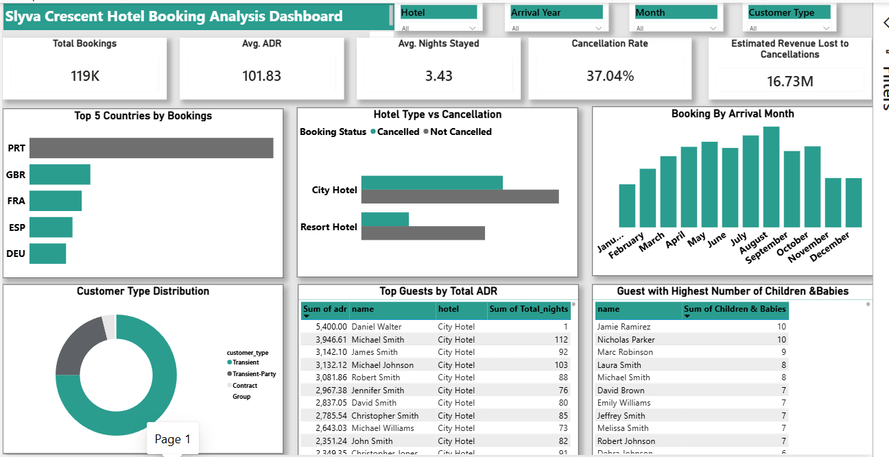
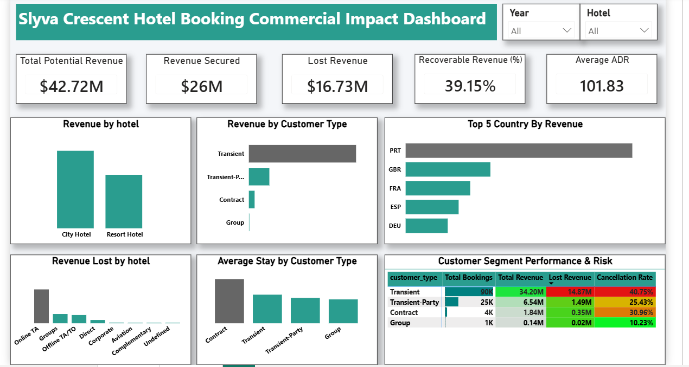

# Power BI Dashboards

| Dashboard | Purpose | Audience |
|-----------|---------|----------|
| Operational Dashboard | Monitor hotel performance and guest behavior | Operations Manager |
| Commercial  Dashboard | Quantify revenue risk and support business decisions | Executive Management |

## Overview

This project includes two interactive Power BI dashboards developed from the same hotel booking dataset.

The first dashboard addresses the original stakeholder requirements by providing operational insights into guest behavior, booking trends, and hotel performance.

The second dashboard was developed as an extension of the original analysis to quantify the commercial impact of booking cancellations and provide management with actionable business recommendations.

Together, these dashboards demonstrate how the same dataset can answer different business questions depending on stakeholder objectives.

---

# Dashboard 1 – Operational Insights

## Objective

Provide management with visibility into guest demographics, booking patterns, and operational performance.

### Key KPIs

- Total Bookings
- Average ADR
- Average Nights Stayed
- Cancelled Bookings

### Visuals Included

- Top 5 Countries by Bookings
- Hotel Type vs Cancellation
- Customer Type Distribution
- Highest ADR Table
- Guests with Children & Babies
- Interactive Slicers

### Dashboard Preview

---

# Dashboard 2 – Commercial Impact

## Objective

Move beyond operational reporting by quantifying revenue exposure caused by booking cancellations and identifying customer segments with the greatest commercial impact.

### Key KPIs

- Estimated Booking Revenue
- Revenue at Risk
- Revenue at Risk (%)
- Average Revenue per Booking
- Cancellation Rate

### Visuals Included

- Revenue by Customer Type
- Revenue by Hotel
- Customer Segment Performance
- Revenue Risk Matrix
- Executive KPI Cards

### Dashboard Preview

---

---

# Key Business Outcome

The Commercial Impact Dashboard estimated approximately **$16.73 million** in booking revenue associated with cancelled reservations.

This insight transformed the analysis from descriptive reporting into decision-focused analytics, enabling management to better understand potential revenue leakage and prioritize actions to improve revenue protection.

---

# Skills Demonstrated

- Power Query
- Data Modeling
- DAX
- Dashboard Design
- KPI Development
- Business Analysis
- Commercial Analysis
- Data Storytelling
